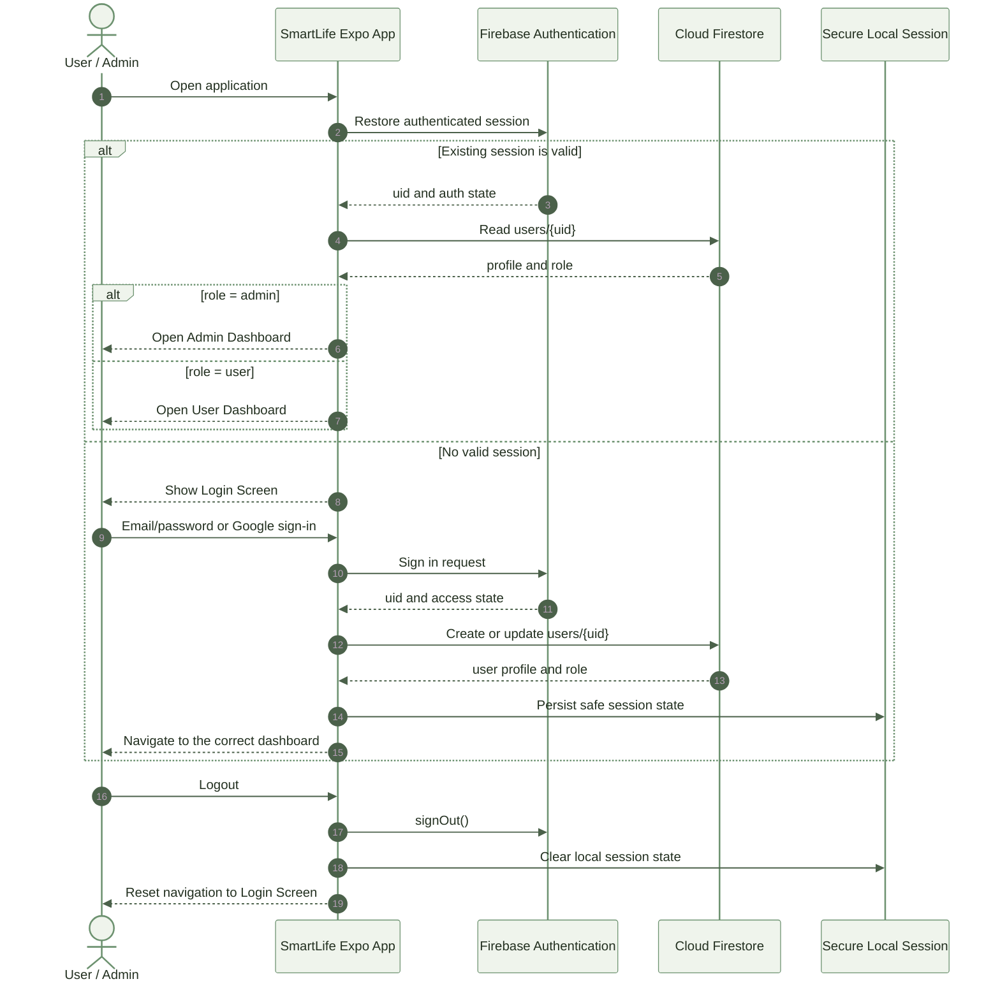
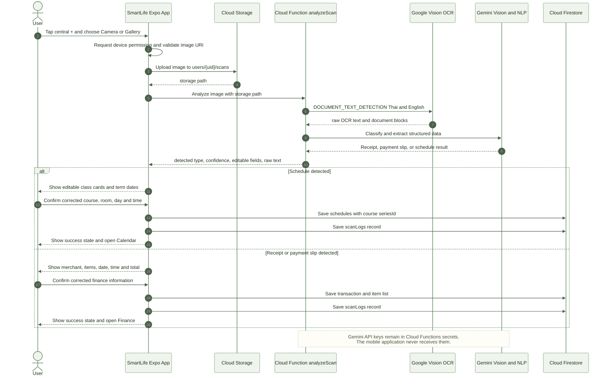
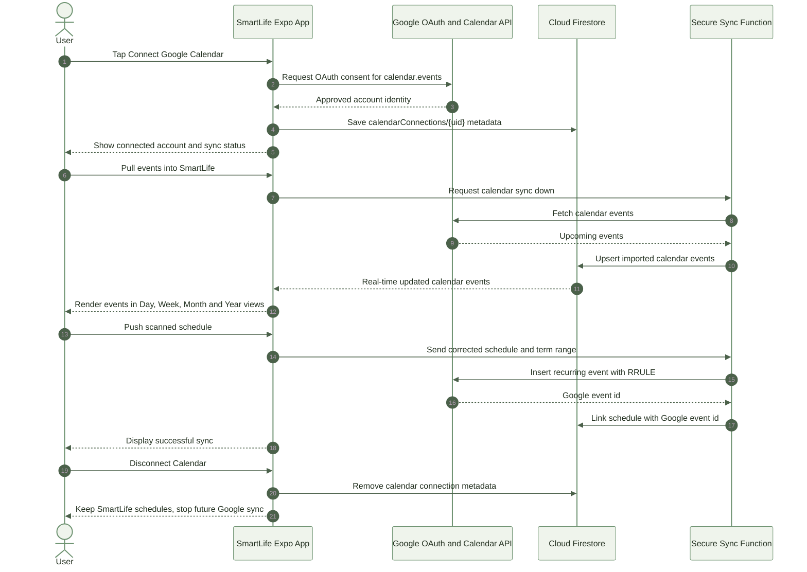
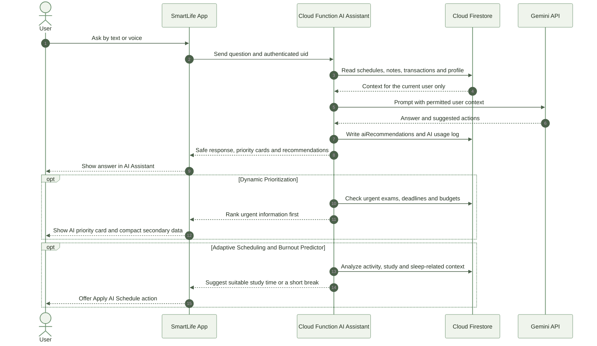
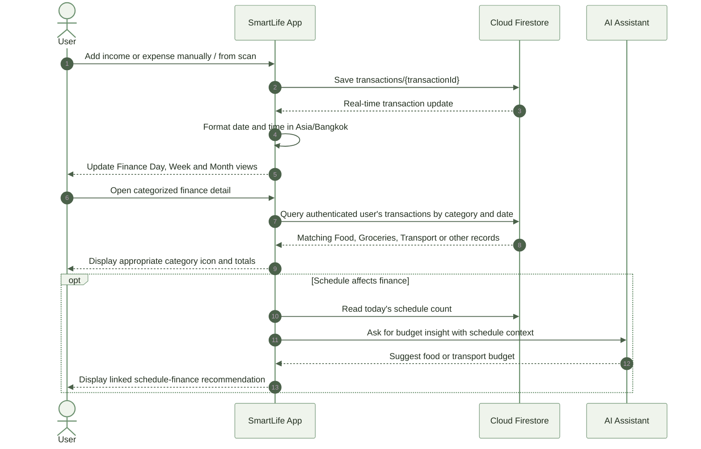
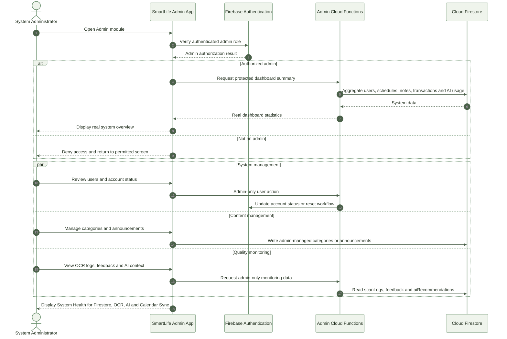
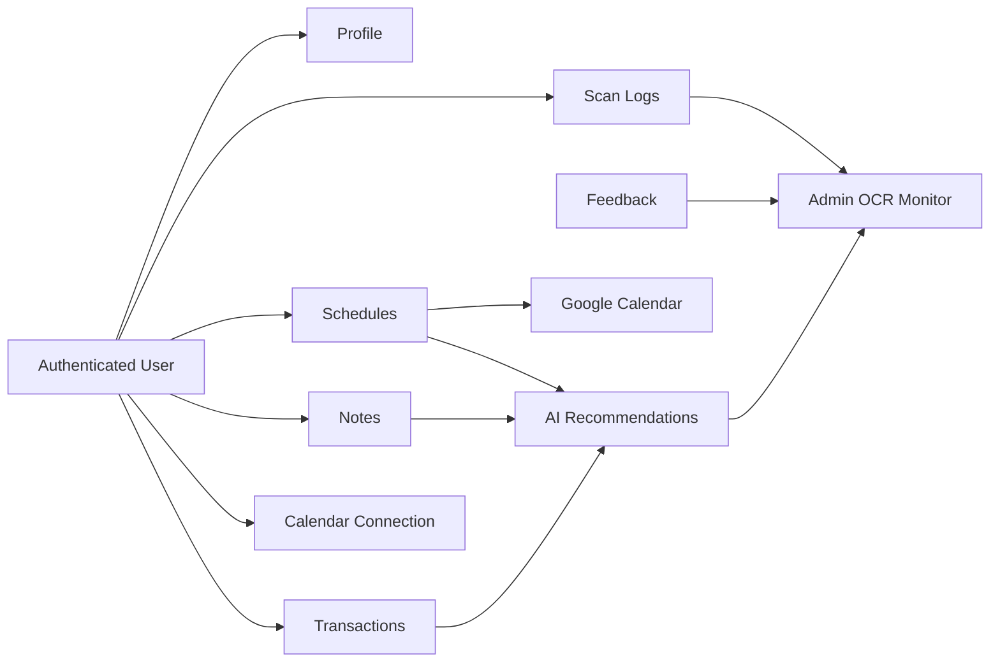

# SmartLife Sequence Diagrams

เอกสารนี้สรุป Sequence Diagram ของระบบ SmartLife ตาม Proposal และระบบที่มีอยู่ในแอปปัจจุบัน ได้แก่ User, Admin, Firebase Authentication, Cloud Firestore, Cloud Storage, Cloud Functions, Google Vision OCR, Gemini API และ Google Calendar

## วิธีเปิดดู

- GitHub จะแสดงแผนภาพ Mermaid อัตโนมัติ
- ใน VS Code เปิด Markdown Preview ด้วย `Ctrl+Shift+V`
- แผนภาพใช้ชื่อระบบจริง แต่ไม่เปิดเผย API key, password หรือ token

## 1. Login, Role และ Session ต่อเนื่อง

## 2. Unified Smart Scan: ตารางเรียน, ใบเสร็จ และสลิป

## 3. Calendar และ Google Calendar Two-Way Sync

## 4. AI Smart Assistant, Prioritization และ Burnout Coach

## 5. Finance, NLP Categorization และข้อมูลเชื่อมกัน

## 6. Admin Console: Monitoring และการจัดการระบบ

## ความเชื่อมโยงของข้อมูล

## ขอบเขตที่ครอบคลุมตามโครงงาน

| ฟังก์ชันโครงงาน | แผนภาพที่เกี่ยวข้อง |
| --- | --- |
| Unified Dashboard และ AI Smart Assistant | 1, 4, 5 |
| Smart Schedule Importer และ OCR | 2 |
| Smart Schedule Builder, Adaptive Schedule, Burnout Coach | 3, 4 |
| Personal Finance Tracker และ NLP Categorization | 2, 5 |
| Calendar Syncing | 3 |
| Admin Dashboard, OCR Log, Feedback, System Health | 6 |

> หมายเหตุ: เอกสารนี้ตั้งใจให้ใช้ใน Proposal, รายงาน Development และการพรีเซนต์ได้เลย โดยไม่ใส่ secret, API key, Firebase configuration หรือข้อมูลผู้ใช้จริง
