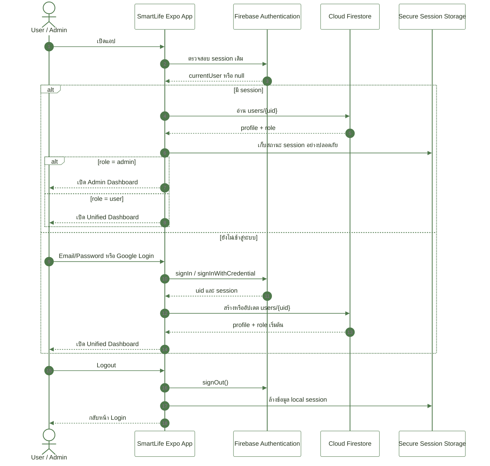
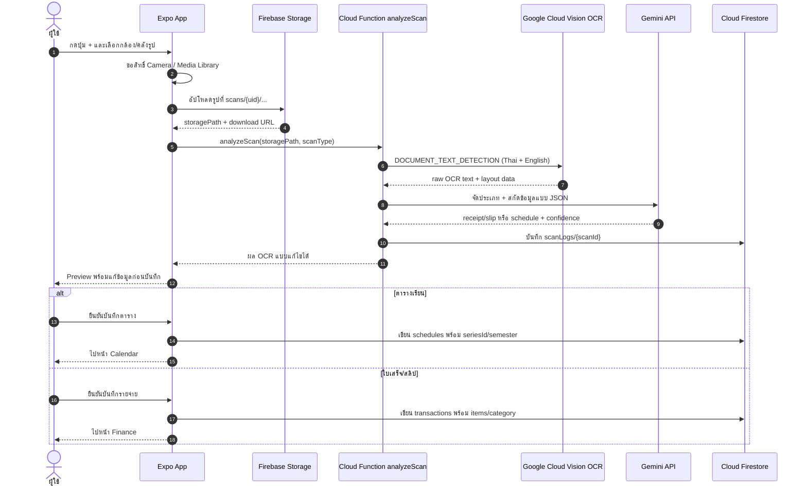
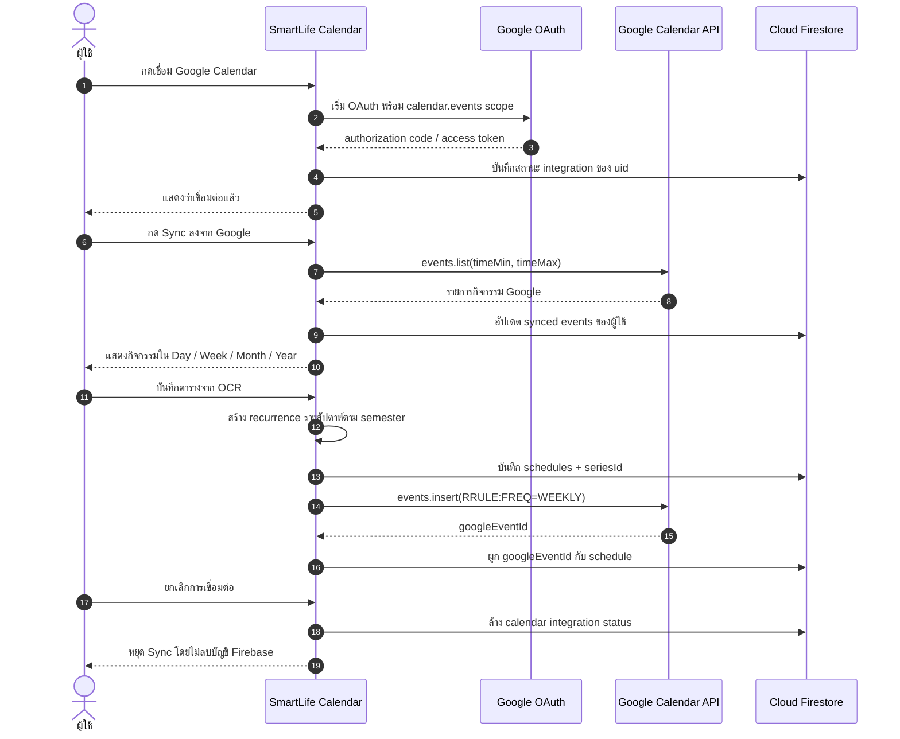
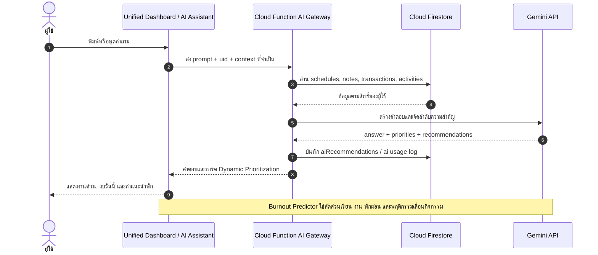
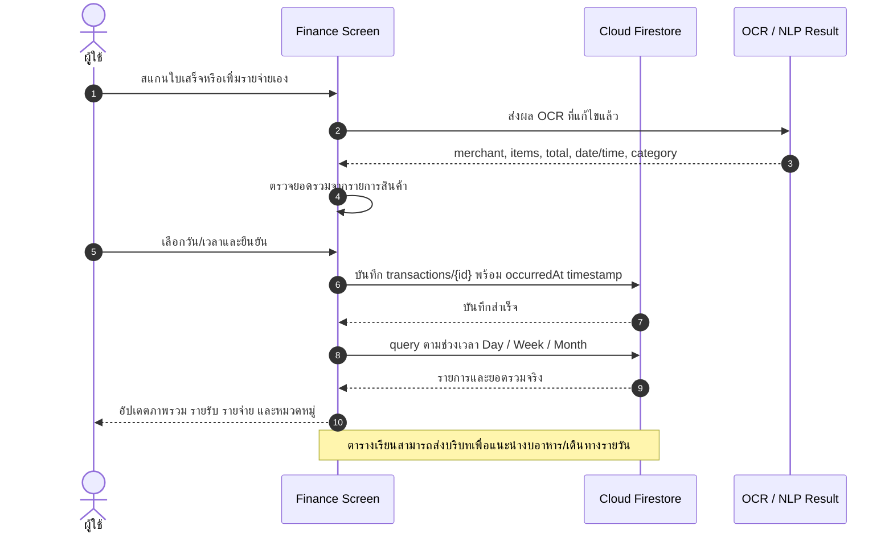
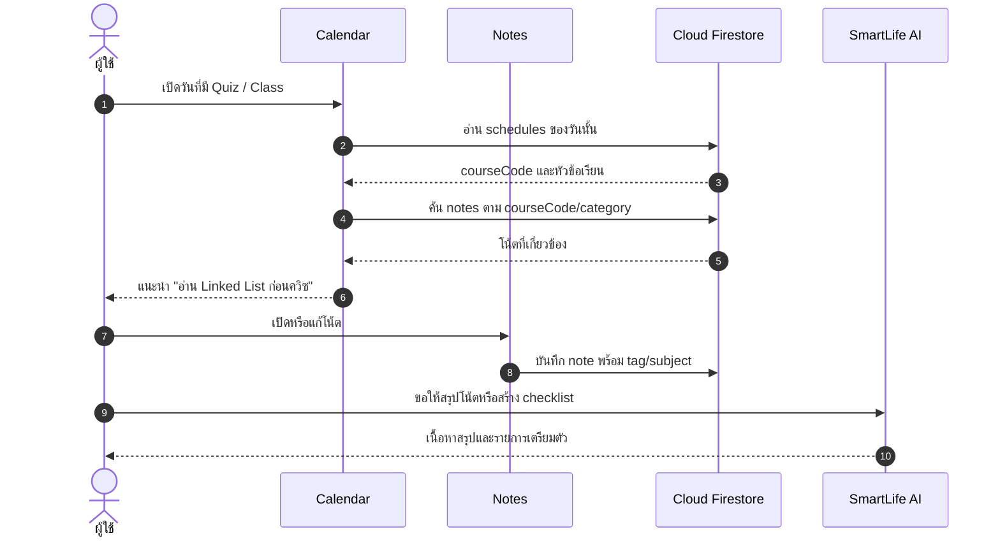
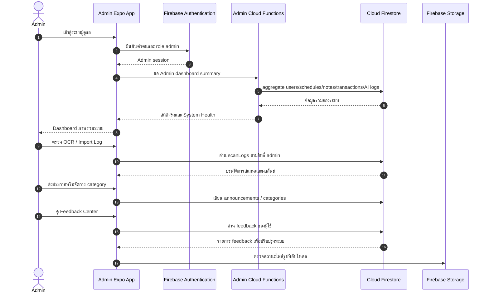
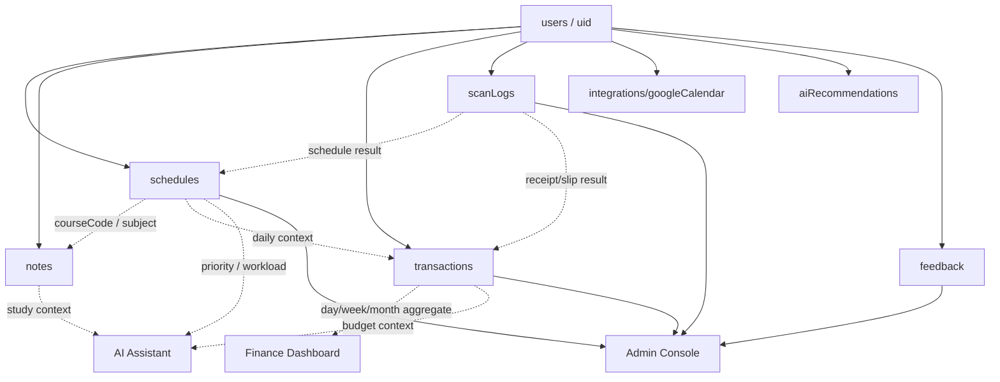

# SmartLife - Sequence Diagrams

เอกสารนี้สรุปลำดับการทำงานจริงของระบบ SmartLife จาก Proposal และฟังก์ชันในแอป เพื่อใช้ประกอบการนำเสนอและพัฒนาต่อร่วมกัน

## 1. Login, Role และ Session

## 2. Unified Smart Scan: ตารางเรียน, ใบเสร็จ และสลิป

## 3. ตารางเรียนและ Google Calendar Two-Way Sync

## 4. AI Assistant, Dynamic Prioritization และ Burnout Coach

## 5. Finance: OCR, NLP Categorization และมุมมอง D/W/M

## 6. Notes เชื่อมกับตารางเวลา

## 7. Admin Console และการตรวจสอบระบบ

## โครงสร้างข้อมูลหลัก

## ความสอดคล้องกับ Proposal

| Proposal Feature | Diagram ที่อธิบาย |
| --- | --- |
| Unified Dashboard, Voice/Text AI, Dynamic Prioritization | 1, 4 |
| Smart Schedule Importer, OCR, Google Calendar Sync | 2, 3 |
| Adaptive Scheduling และ Burnout Coach | 4 |
| Personal Finance Tracker และ Smart Expense Categorization | 2, 5 |
| ตารางเวลาเชื่อม Notes และ Finance | 5, 6 |
| ระบบ Admin, OCR Logs, Feedback, System Health | 7 |
