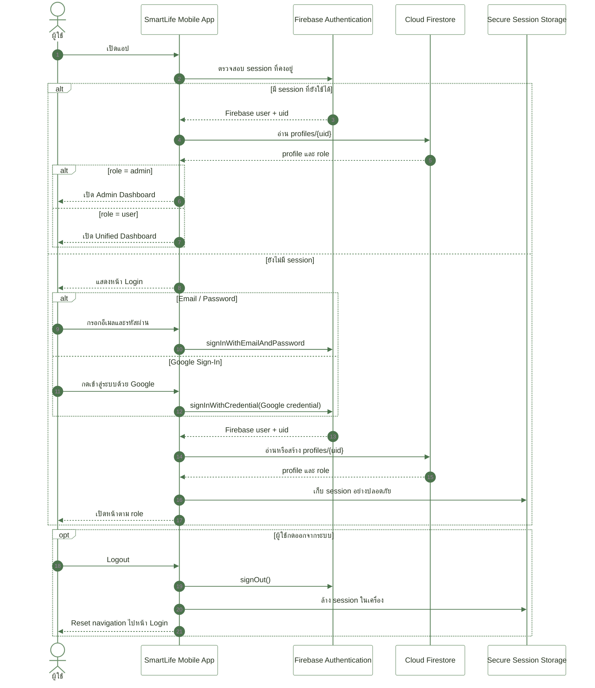
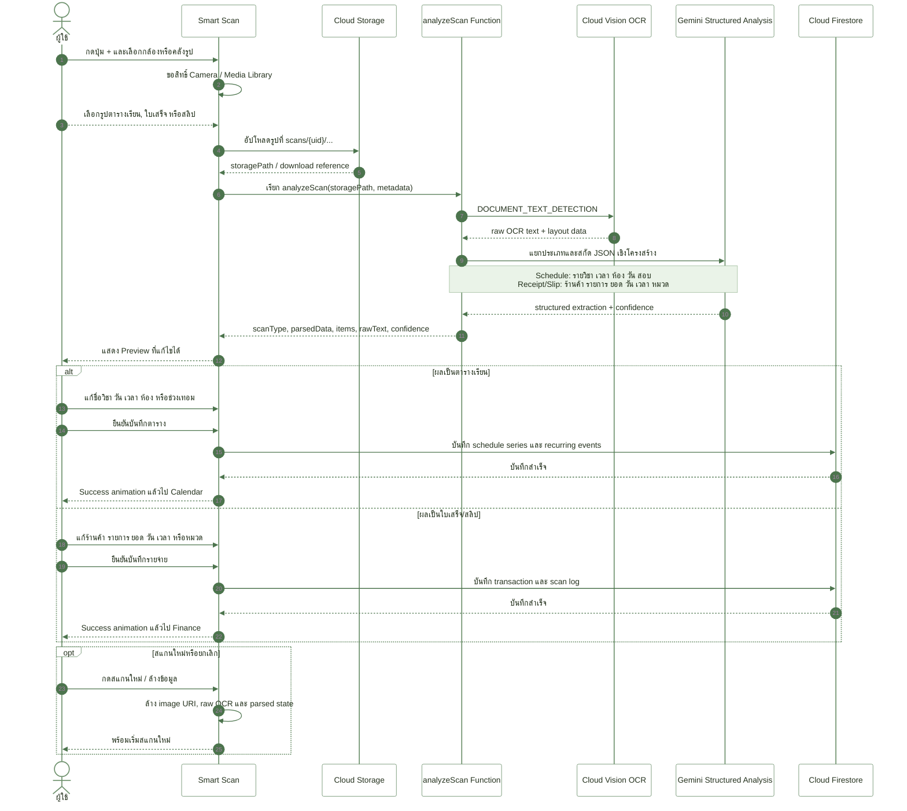
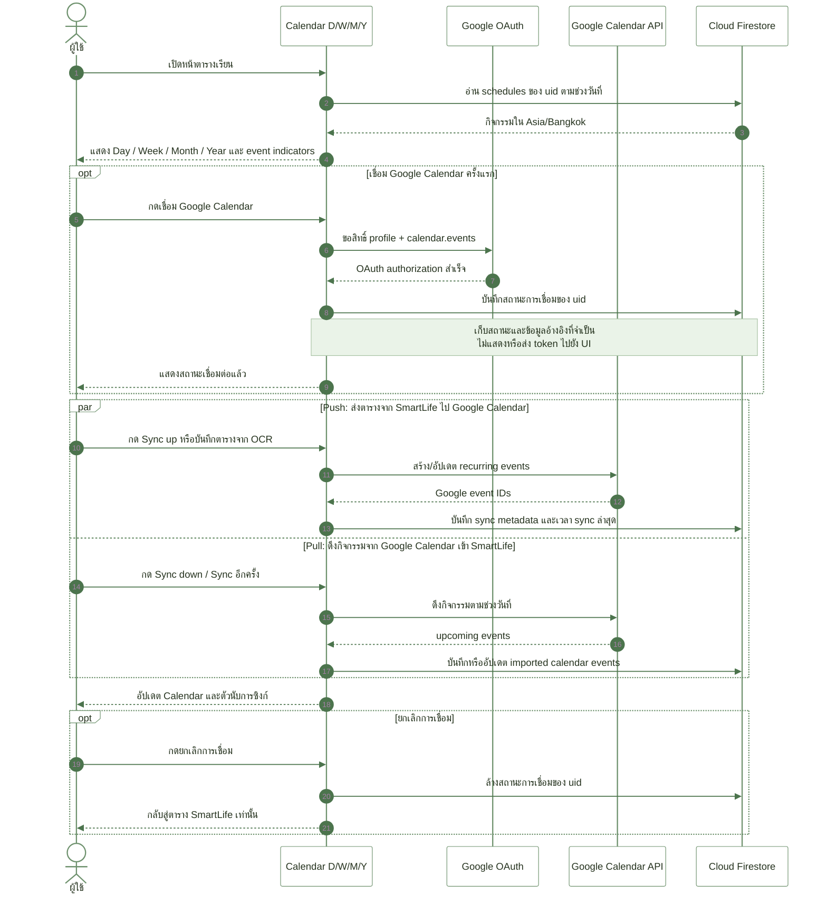
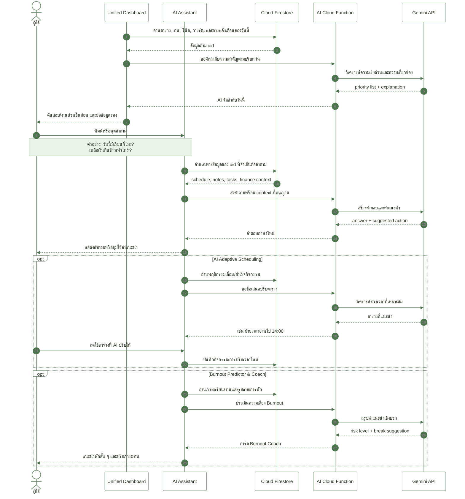
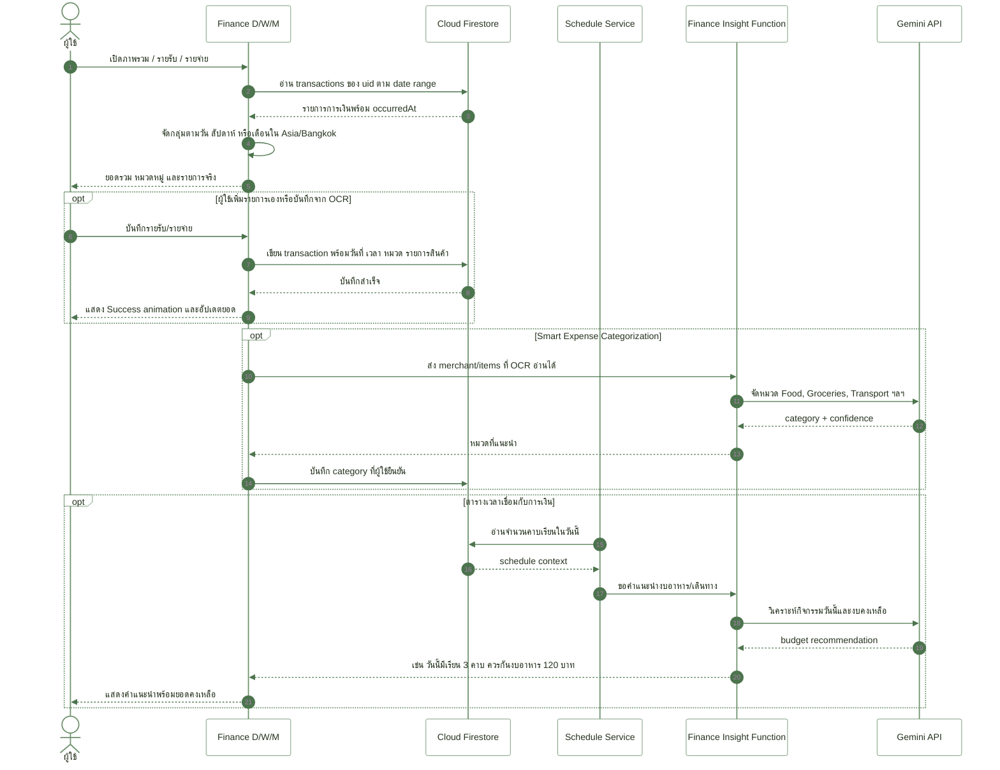
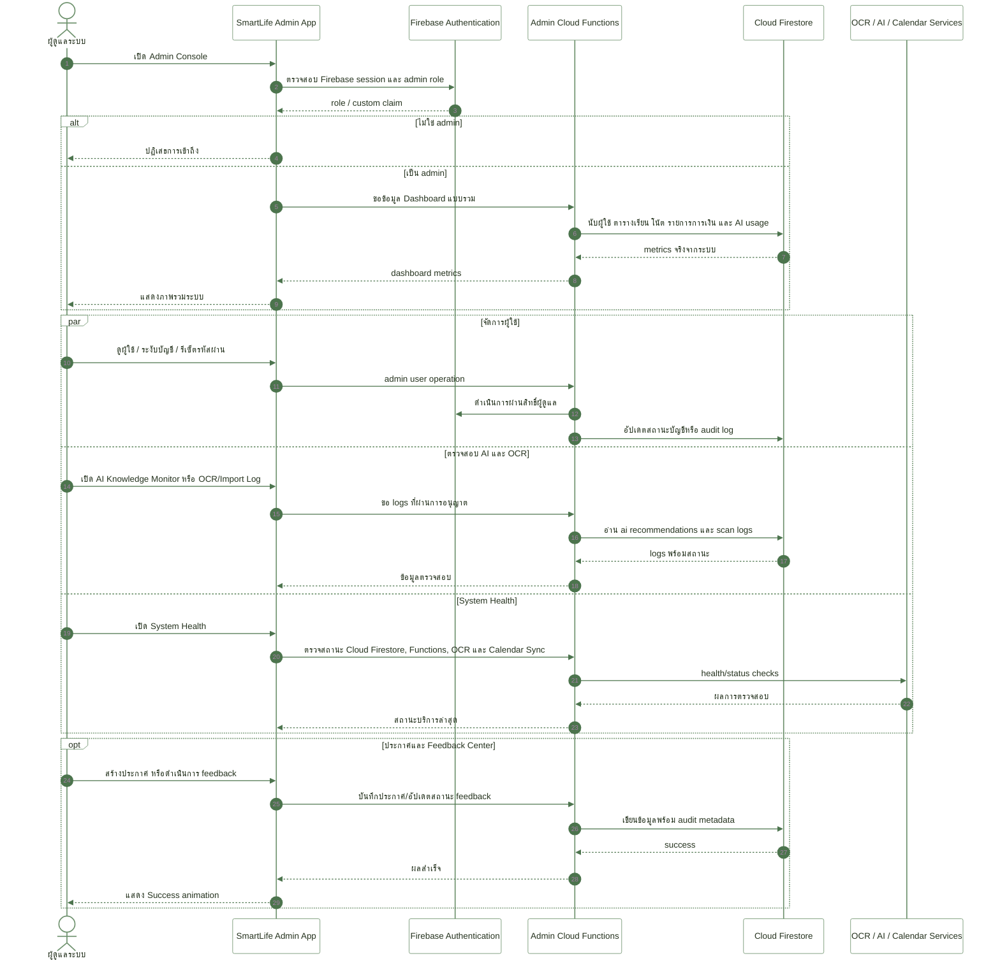
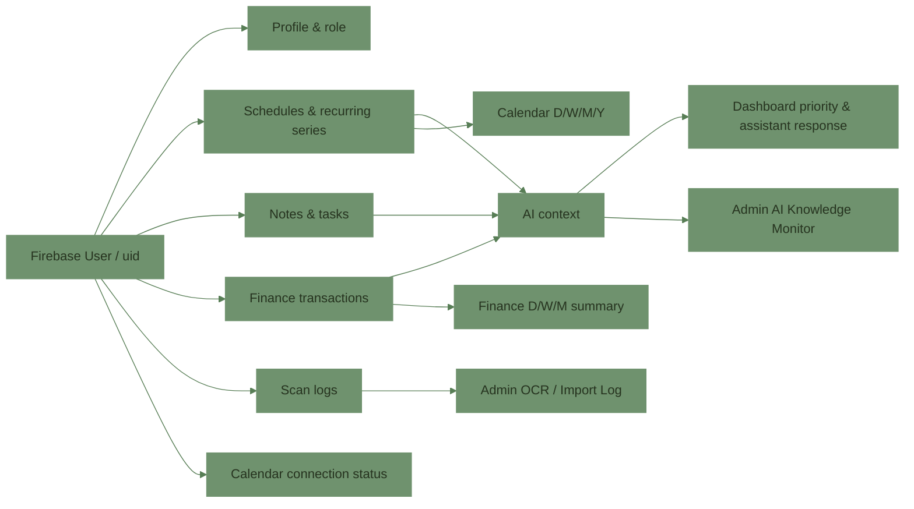

# SmartLife Sequence Diagrams

เอกสารนี้สรุปลำดับการทำงานของระบบ SmartLife ตาม Proposal และระบบที่พัฒนาอยู่จริงในแอป Expo/Firebase เพื่อใช้ตรวจงาน นำเสนอ และต่อยอดการพัฒนา

## ขอบเขตระบบ

- Mobile App: Expo / React Native สำหรับผู้ใช้และผู้ดูแลระบบ
- Authentication: Firebase Authentication (Email/Password และ Google Sign-In)
- Database: Cloud Firestore
- File storage: Cloud Storage for Firebase
- Processing: Firebase Cloud Functions (`asia-southeast1`)
- OCR: Google Cloud Vision และ Gemini API สำหรับตรวจทาน/แยกข้อมูลเชิงโครงสร้าง
- Calendar: Google Calendar API แบบเชื่อมและซิงก์ตามสิทธิ์ที่ผู้ใช้อนุญาต
- Time zone หลักของข้อมูลเวลาในแอป: `Asia/Bangkok` (UTC+7)

> หมายเหตุ: API key, Secret, Access token และข้อมูลบัญชีจริงไม่อยู่ในแผนภาพหรือเอกสารนี้

---

## 1. Login และการคงสถานะการเข้าสู่ระบบ

---

## 2. Smart Scan: อัปโหลดภาพ, OCR, ตรวจแก้ และบันทึกข้อมูล

---

## 3. ตารางเรียนและ Google Calendar Two-Way Sync

---

## 4. AI Assistant, Dynamic Prioritization และ Burnout Coach

---

## 5. Personal Finance และการเชื่อมข้อมูลกับตารางเวลา

---

## 6. Admin Console: ภาพรวม, ตรวจสอบระบบ และจัดการข้อมูล

---

## ความสัมพันธ์ของข้อมูลหลัก

## Checklist สำหรับตรวจงาน

- [ ] Diagram 1: ผู้ใช้ใหม่และผู้ใช้เดิมเข้าระบบถูก flow
- [ ] Diagram 2: สแกนแล้วต้องแก้ไขก่อนบันทึกได้ ทั้งตารางและการเงิน
- [ ] Diagram 3: Calendar รองรับ D/W/M/Y และเชื่อม Google Calendar ได้
- [ ] Diagram 4: AI Assistant, Dynamic Prioritization, Adaptive Scheduling และ Burnout Coach มีครบ
- [ ] Diagram 5: การเงินดึงข้อมูลจริงตามวัน/สัปดาห์/เดือน และเชื่อมตารางเวลาได้
- [ ] Diagram 6: Admin ครอบคลุม Dashboard, Users, Categories, AI Monitor, OCR Log, Announcements, Feedback และ System Health
