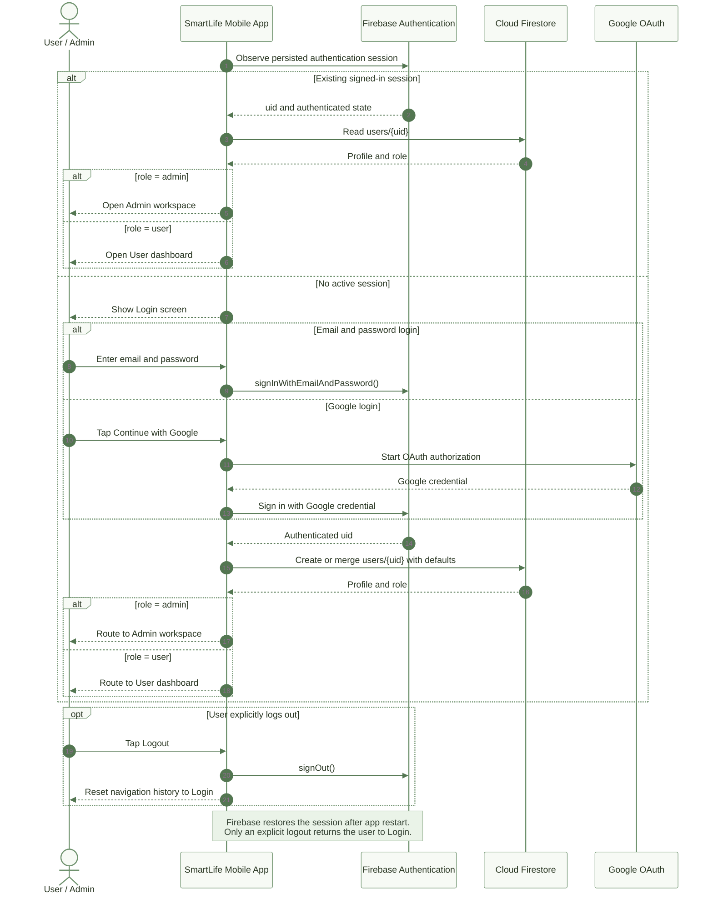

# 01. Authentication and Persistent Session

แผนภาพนี้อธิบายการเข้าสู่ระบบด้วย Email/Password หรือ Google, การสร้าง profile เริ่มต้น และการจำ session จนกว่าผู้ใช้จะ logout

```mermaid
%%{init: {'theme':'base','themeVariables':{'fontFamily':'Arial, Tahoma, sans-serif','primaryColor':'#6F926E','primaryTextColor':'#26331F','primaryBorderColor':'#6F926E','lineColor':'#6F926E','secondaryColor':'#EAF3E8','tertiaryColor':'#FFFFFF','actorBkg':'#F7FAF5','actorBorder':'#6F926E','actorTextColor':'#26331F','signalColor':'#537651','signalTextColor':'#26331F','noteBkgColor':'#EAF3E8','noteBorderColor':'#A7BFA4','noteTextColor':'#334032'}}}%%
sequenceDiagram
    autonumber
    actor User as User / Admin
    participant App as SmartLife Mobile App
    participant Auth as Firebase Authentication
    participant DB as Cloud Firestore
    participant Google as Google OAuth

    App->>Auth: Observe persisted authentication session
    alt Existing signed-in session
        Auth-->>App: uid and authenticated state
        App->>DB: Read users/{uid}
        DB-->>App: Profile and role
        alt role = admin
            App-->>User: Open Admin workspace
        else role = user
            App-->>User: Open User dashboard
        end
    else No active session
        App-->>User: Show Login screen
        alt Email and password login
            User->>App: Enter email and password
            App->>Auth: signInWithEmailAndPassword()
        else Google login
            User->>App: Tap Continue with Google
            App->>Google: Start OAuth authorization
            Google-->>App: Google credential
            App->>Auth: Sign in with Google credential
        end
        Auth-->>App: Authenticated uid
        App->>DB: Create or merge users/{uid} with defaults
        DB-->>App: Profile and role
        alt role = admin
            App-->>User: Route to Admin workspace
        else role = user
            App-->>User: Route to User dashboard
        end
    end

    opt User explicitly logs out
        User->>App: Tap Logout
        App->>Auth: signOut()
        App-->>User: Reset navigation history to Login
    end

    Note over App,Auth: Firebase restores the session after app restart.<br/>Only an explicit logout returns the user to Login.
```
