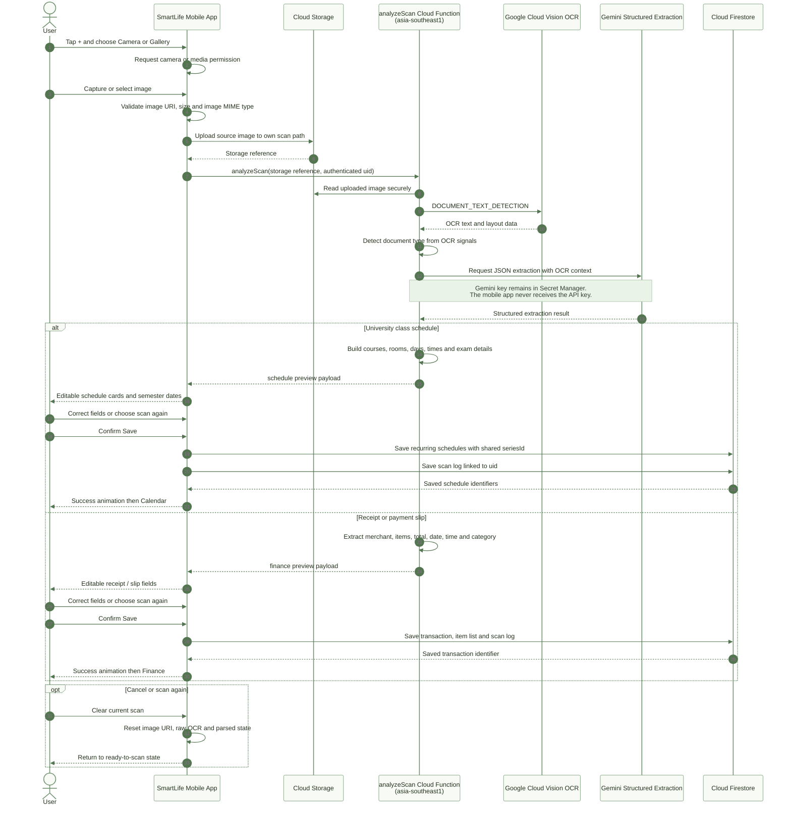

# 02. Unified OCR Scan and Confirm Save

แผนภาพนี้อธิบายปุ่ม `+` กลางแอปที่รับได้ทั้งตารางเรียน ใบเสร็จ และสลิป โดยให้ผู้ใช้ตรวจแก้ข้อมูลก่อนบันทึก

```mermaid
%%{init: {'theme':'base','themeVariables':{'fontFamily':'Arial, Tahoma, sans-serif','primaryColor':'#6F926E','primaryTextColor':'#26331F','primaryBorderColor':'#6F926E','lineColor':'#6F926E','secondaryColor':'#EAF3E8','tertiaryColor':'#FFFFFF','actorBkg':'#F7FAF5','actorBorder':'#6F926E','actorTextColor':'#26331F','signalColor':'#537651','signalTextColor':'#26331F','noteBkgColor':'#EAF3E8','noteBorderColor':'#A7BFA4','noteTextColor':'#334032'}}}%%
sequenceDiagram
    autonumber
    actor User as User
    participant App as SmartLife Mobile App
    participant Storage as Cloud Storage
    participant Function as analyzeScan Cloud Function<br/>(asia-southeast1)
    participant Vision as Google Cloud Vision OCR
    participant Gemini as Gemini Structured Extraction
    participant DB as Cloud Firestore

    User->>App: Tap + and choose Camera or Gallery
    App->>App: Request camera or media permission
    User->>App: Capture or select image
    App->>App: Validate image URI, size and image MIME type
    App->>Storage: Upload source image to own scan path
    Storage-->>App: Storage reference
    App->>Function: analyzeScan(storage reference, authenticated uid)
    Function->>Storage: Read uploaded image securely
    Function->>Vision: DOCUMENT_TEXT_DETECTION
    Vision-->>Function: OCR text and layout data
    Function->>Function: Detect document type from OCR signals
    Function->>Gemini: Request JSON extraction with OCR context
    Note over Function,Gemini: Gemini key remains in Secret Manager.<br/>The mobile app never receives the API key.
    Gemini-->>Function: Structured extraction result

    alt University class schedule
        Function->>Function: Build courses, rooms, days, times and exam details
        Function-->>App: schedule preview payload
        App-->>User: Editable schedule cards and semester dates
        User->>App: Correct fields or choose scan again
        User->>App: Confirm Save
        App->>DB: Save recurring schedules with shared seriesId
        App->>DB: Save scan log linked to uid
        DB-->>App: Saved schedule identifiers
        App-->>User: Success animation then Calendar
    else Receipt or payment slip
        Function->>Function: Extract merchant, items, total, date, time and category
        Function-->>App: finance preview payload
        App-->>User: Editable receipt / slip fields
        User->>App: Correct fields or choose scan again
        User->>App: Confirm Save
        App->>DB: Save transaction, item list and scan log
        DB-->>App: Saved transaction identifier
        App-->>User: Success animation then Finance
    end

    opt Cancel or scan again
        User->>App: Clear current scan
        App->>App: Reset image URI, raw OCR and parsed state
        App-->>User: Return to ready-to-scan state
    end
```
