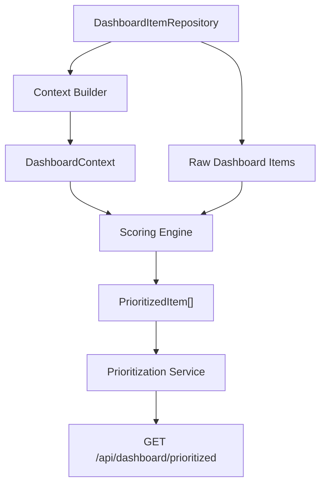

# SmartLife AI Dynamic Prioritization

This module ranks dashboard items for the SmartLife Unified Dashboard. It is designed as a real, extensible backend feature rather than a UI-only demo.

## Files

```text
src/dashboard/
  types.ts
  contextBuilder.ts
  scoringEngine.ts
  prioritizationService.ts
  prioritization.routes.ts
  SCORING_PSEUDOCODE.md
  __tests__/
    scoringEngine.test.ts
    prioritizationService.test.ts
    run-dashboard-tests.mjs
```

## Data flow



## Scoring overview

The scoring engine is a pure TypeScript function:

```ts
prioritizeDashboardItems(items, context, config)
```

It combines:

- base urgency score
- type severity
- time urgency
- finance severity
- wellbeing severity
- exam-day override
- past-item decay

Every `PrioritizedItem` returns:

- `score`
- `visibility`
- `reason`
- `raw`

## Config tuning

Weights and thresholds are stored in `defaultPriorityScoringConfig` inside `scoringEngine.ts`.

Example override:

```ts
service.getPrioritizedDashboard({
  config: {
    displayCap: 3,
    weights: {
      timeUrgency: 40,
      typeSeverity: {
        exam: 40,
      },
    },
  },
  userId: 'student-uid',
});
```

This makes parameters defensible during project presentation because tuning does not require rewriting core logic.

## Express integration

The route module is Express-compatible without requiring `express` in the Expo app package:

```ts
import express from 'express';
import {InMemoryDashboardItemRepository} from './contextBuilder';
import {DashboardPrioritizationService} from './prioritizationService';
import {registerPrioritizationRoutes} from './prioritization.routes';

const app = express();
const repository = new InMemoryDashboardItemRepository();
const service = new DashboardPrioritizationService(repository);

registerPrioritizationRoutes(app, service);
```

Endpoint:

```text
GET /api/dashboard/prioritized?userId=student-uid&displayCap=5
```

## Connecting Firebase later

Implement `DashboardItemRepository`:

```ts
class FirebaseDashboardItemRepository implements DashboardItemRepository {
  async listDashboardItems(userId: string): Promise<DashboardItem[]> {
    // Query schedules, activities, transactions, notes, and wellbeing signals.
    // Map each record into DashboardItem union types.
    return [];
  }
}
```

The scoring engine and service do not need to change.

## Tests

Run:

```bash
npm test
```

Covered edge cases:

1. Empty dashboard returns no items.
2. High-risk wellbeing alert ranks above an exam within one hour.
3. Past items are hidden.
4. 100+ items obey the display cap.
5. Finance alert severity differs between low remaining budget and over budget.
6. Asia/Bangkok timezone input is handled through ISO timestamps with `+07:00`.
